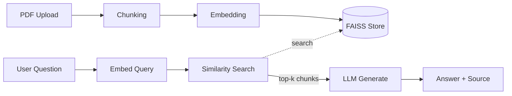
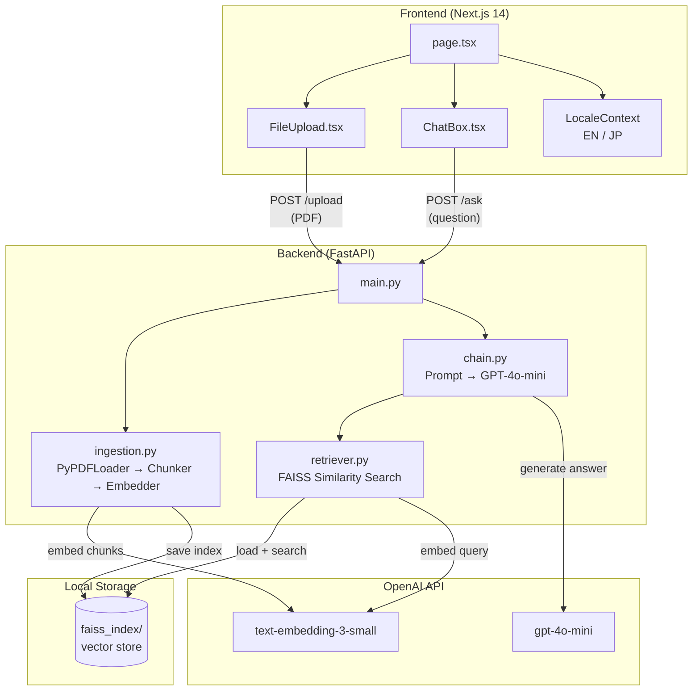
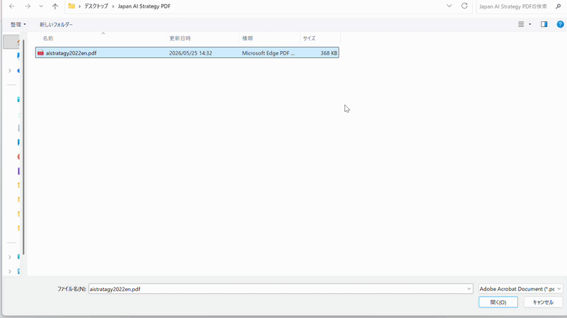

# document-qa-rag


A production-ready RAG (Retrieval-Augmented Generation) system that allows users to upload PDF documents and ask questions in natural language. Answers are returned with source citations and page references in real time.

---

## System Flow



## Architecture



## Demo



## Features

- PDF upload and automatic indexing
- Semantic search using FAISS vector store
- Streaming responses with real-time output
- Source citations with page number references
- Conversation history per session
- Japanese PDF document support

---

## Tech Stack

| Layer | Technology |
|---|---|
| Frontend | Next.js 14 (App Router) |
| Backend | FastAPI |
| RAG Pipeline | LangChain + FAISS |
| LLM | OpenAI GPT-4o-mini |
| Embeddings | OpenAI text-embedding-3-small |

---

## Project Structure

```
document-qa-rag/
├── frontend/
│   ├── app/
│   │   └── page.tsx
│   └── components/
│       ├── ChatBox.tsx
│       └── FileUpload.tsx
├── backend/
│   ├── main.py
│   ├── rag/
│   │   ├── ingestion.py
│   │   ├── retriever.py
│   │   └── chain.py
│   └── requirements.txt
└── README.md
```

---

## Quick Start

### Prerequisites

- Python 3.11+
- Node.js 18+
- OpenAI API Key

### Backend Setup

```bash
cd backend
python -m venv venv
source venv/bin/activate
pip install -r requirements.txt
uvicorn main:app --reload
```

### Frontend Setup

```bash
cd frontend
npm install
npm run dev
```

Open [http://localhost:3000](http://localhost:3000) in your browser.

---

## Environment Variables

Create a `.env` file in the `backend` directory:

```
OPENAI_API_KEY=your_openai_api_key
```

---

## Performance

- Retrieval latency: ~150ms average
- Streaming starts within 300ms
- Tested on documents up to 200 pages

---

*Built with LangChain, FastAPI, and Next.js*
